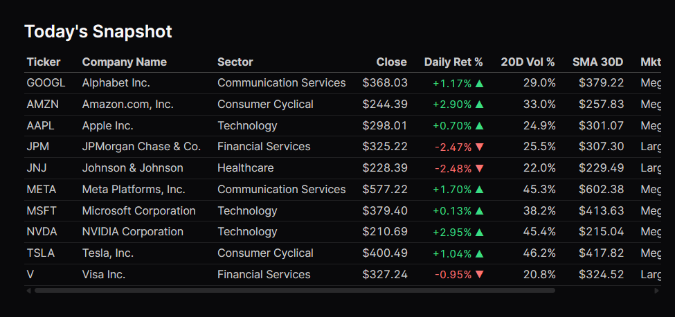

# 📈 Finance Analytics Pipeline

> A full end-to-end ELT data pipeline pulling real stock market data from Yahoo Finance, loading it into DuckDB, transforming it with dbt, testing it with custom data quality rules, and orchestrating it all with Dagster — running entirely on your local machine.



---

## What This Project Demonstrates

This is a portfolio project built to show data engineering fundamentals across the full stack:

| Concept | How It's Shown Here |
|---|---|
| **ELT pattern** | Extract → raw Parquet → DuckDB raw schema → dbt transforms |
| **Multi-source integration** | Yahoo Finance (yfinance) + FRED Federal Reserve API |
| **Data modeling** | Star schema: `fct_daily_trading` + `dim_company` + `dim_date` |
| **SQL window functions** | Moving averages, lag returns, rolling volatility, 52-week ranges |
| **Mixed-frequency alignment** | Forward-filling monthly/quarterly FRED data to daily grain |
| **dbt layering** | Staging → Intermediate → Marts with clear separation of concerns |
| **Data quality** | 8 custom SQL tests + schema tests + source freshness checks |
| **Data contracts** | Explicit column types declared on every source table |
| **CI/CD** | GitHub Actions | dbt tests + pytest on every commit; auto-deploys dashboard to GitHub Pages |
| **Cloud migration** | BigQuery | Drop-in replacement for DuckDB via a single `TARGET` env var |
| **AI commentary** | Gemini 2.5 Flash | LLM-generated market briefing injected into the dashboard at deploy time |

---

## Tech Stack

| Layer | Tool | Why |
|---|---|---|
| Language | Python 3.13 | Industry standard for data engineering |
| Database | DuckDB (local) / BigQuery (cloud) | DuckDB for local dev; BigQuery for production |
| Transformation | dbt-core + dbt-duckdb / dbt-bigquery | Industry-standard SQL transformation framework |
| Orchestration | Dagster | Modern orchestrator with a great local dev UI |
| Data Source | Yahoo Finance (yfinance) + FRED Federal Reserve | Free, real market & economic data |
| Visualization | Evidence | Markdown-based BI — SQL + charts, no drag-and-drop |
| AI | Gemini 2.5 Flash (Google AI Studio) | LLM-generated market briefing at deploy time |
| Testing | pytest + dbt test + Playwright | Unit tests for Python, schema/quality tests for SQL, smoke tests for the dashboard UI |
| CI/CD | GitHub Actions | Tests on every PR; auto-deploys dashboard to GitHub Pages |

---

## Architecture

```
┌─────────────────────────────────────────────────────────────────────┐
│                        EXTRACT (Python)                             │
│  yfinance API ──▶  extract/stock_prices.py  ──▶  data/raw/*.parquet │
│  FRED API     ──▶  extract/economic_indicators.py  ──▶         "    │
└────────────────────────────┬────────────────────────────────────────┘
                             │
                             ▼
┌─────────────────────────────────────────────────────────────────────┐
│                         LOAD (Python)                               │
│  data/raw/*.parquet  ──▶  load/loader.py  ──▶  DuckDB: raw schema  │
└────────────────────────────┬────────────────────────────────────────┘
                             │
                             ▼
┌─────────────────────────────────────────────────────────────────────┐
│                      TRANSFORM (dbt)                                │
│                                                                     │
│  raw.raw_stock_prices    ──▶  stg_stock_prices ──┐                  │
│  raw.raw_company_info    ──▶  stg_company_info   ├──▶ int_daily_returns
│  raw.raw_econ_indicators ──▶  stg_econ_indicators─┤──▶ int_moving_avgs
│                                                  └──▶ int_volatility │
│                                               int_macro_context ──┐  │
│                                                                   ▼  │
│                              fct_daily_trading  dim_company dim_date │
└────────────────────────────┬────────────────────────────────────────┘
                             │
                             ▼
┌─────────────────────────────────────────────────────────────────────┐
│                    ORCHESTRATE (Dagster)                            │
│                                                                     │
│  raw_stock_prices ──┐                                               │
│  raw_company_info ──┼──▶ raw_tables ──▶ dbt_staging               │
│  raw_econ_indic.  ──┘         ──▶ dbt_intermediate ──▶ dbt_marts   │
│                                                     ──▶ dbt_tests   │
│  Schedules: weekdays 11pm UTC  │  Saturday 8am UTC                  │
└────────────────────────────┬────────────────────────────────────────┘
                             │
                             ▼
┌─────────────────────────────────────────────────────────────────────┐
│                    VISUALIZE (Evidence)                             │
│  dashboard/  ──▶  SQL queries on DuckDB/BigQuery  ──▶  localhost:3002│
│  Pages: Overview · Stock Deep Dive · Macro Context · AI Briefing   │
│                                                                     │
│  generate_briefing.py  ──▶  Gemini 2.5 Flash  ──▶  briefing.md     │
└─────────────────────────────────────────────────────────────────────┘
```

---

## Data Model

```
                    ┌──────────────────┐
                    │   dim_date       │
                    │──────────────────│
                    │ calendar_date PK │
                    │ year             │
                    │ month_name       │
                    │ quarter_num      │
                    │ is_trading_day   │
                    │ fiscal_quarter.. │
                    └────────┬─────────┘
                             │
┌──────────────┐    ┌────────▼─────────────────────────────┐
│ dim_company  │    │         fct_daily_trading             │
│──────────────│    │───────────────────────────────────────│
│ company_key  │    │ price_id          PK                  │
│ ticker       ◄────┤ ticker            FK → dim_company    │
│ company_name │    │ trading_date      FK → dim_date       │
│ sector       │    │ open_price                            │
│ industry     │    │ close_price                           │
│ market_cap   │    │ prev_close_price                      │
│ market_cap.. │    │ daily_return_pct                      │
│ exchange     │    │ log_return_pct                        │
│ country      │    │ sma_7d / 30d / 90d / 200d             │
└──────────────┘    │ volume / avg_volume_20d               │
                    │ volatility_20d_annualized             │
                    │ high_52w / low_52w                    │
                    │ price_position_52w                    │
                    └───────────────────────────────────────┘
```

---

## Project Structure

```
data-engineer-finance-analytics/
│
├── extract/                     # E — Extraction layer
│   ├── stock_prices.py          # yfinance: OHLCV prices + company metadata
│   └── economic_indicators.py   # FRED: 6 macroeconomic series
│
├── load/                        # L — Loading layer
│   └── loader.py                # Parquet → DuckDB raw schema
│
├── transform/                   # T — dbt project
│   ├── models/
│   │   ├── staging/             # 1:1 clean copies of raw sources
│   │   ├── intermediate/        # Business logic (returns, MAs, volatility, macro)
│   │   └── marts/               # Star schema (fact + dimensions)
│   ├── macros/                  # Reusable SQL (CAGR, Sharpe, drawdown)
│   ├── seeds/                   # S&P 500 company reference list
│   └── tests/                   # 8 custom data quality tests
│
├── orchestrate/                 # Dagster pipeline definitions
│   ├── assets.py                # 8 software-defined assets
│   ├── jobs.py                  # full_pipeline / ingest_only / transform_only
│   ├── schedules.py             # Weekday + weekend cron schedules
│   └── definitions.py           # Dagster entry point
│
├── dashboard/                   # Evidence BI dashboard
│   ├── pages/
│   │   ├── index.md             # Overview: KPIs, 52W returns, sector table
│   │   ├── briefing.md          # AI Market Briefing (Gemini-generated)
│   │   ├── stocks/index.md      # Stock deep dive with ticker dropdown
│   │   └── macro/index.md       # FRED indicators + rate regime analysis
│   ├── sources/finance/         # SQL queries against DuckDB/BigQuery
│   ├── tests/                   # Playwright smoke tests for the dashboard UI
│   │   └── dashboard.spec.js
│   └── playwright.config.js
│
├── generate_briefing.py         # AI briefing generator (Gemini 2.5 Flash)
│
├── tests/                       # Python unit tests (pytest)
│   ├── test_extraction.py
│   └── test_loading.py
│
├── data/                        # Local data lake (gitignored)
│   ├── raw/                     # Extracted Parquet files
│   └── processed/               # DuckDB database file
│
└── main.py                      # CLI: run full pipeline or individual steps
```

---

## Data Sources

### Yahoo Finance (via `yfinance`)
No API key required. Provides 2 years of daily OHLCV prices and company metadata for 10 S&P 500 stocks.

### FRED — Federal Reserve Bank of St. Louis
Free API key required (2-minute signup at [fred.stlouisfed.org](https://fred.stlouisfed.org/docs/api/api_key.html)).

| Series | ID | Frequency |
|---|---|---|
| Federal Funds Rate | `FEDFUNDS` | Monthly |
| Consumer Price Index | `CPIAUCSL` | Monthly |
| Unemployment Rate | `UNRATE` | Monthly |
| 10-Year Treasury Yield | `DGS10` | Daily |
| Real GDP Growth Rate | `A191RL1Q225SBEA` | Quarterly |
| 10-Year Breakeven Inflation | `T10YIE` | Daily |

Mixed frequencies are forward-filled in `int_macro_context` so every trading day has a macro snapshot.

---

## Setup

**Prerequisites:** Python 3.11+ and [uv](https://docs.astral.sh/uv/) installed.

```bash
# 1. Clone and enter the project
git clone <your-repo>
cd data-engineer-finance-analytics

# 2. Create the virtual environment and install dependencies
uv sync

# 3. Install dbt packages
cd transform && dbt deps && cd ..

# 4. Add your FRED API key
copy .env.example .env   # then open .env and replace your_key_here with your key
```

---

## Running the Pipeline

### Option A — CLI (simplest)

```bash
# Full pipeline: Extract → Load → Transform
uv run python main.py

# Or run individual steps
uv run python main.py extract
uv run python main.py load
uv run python main.py transform
```

### Option B — Dagster UI (recommended)

```bash
uv run dagster dev -m orchestrate -p 3001
# Opens http://localhost:3001
```

In the UI you can:
- See the full asset lineage graph
- Click any asset and hit **Materialize**
- Inspect logs and row-count metadata per run
- Toggle schedules on/off
- Re-run failed steps without re-running the whole pipeline

### Option C — dbt directly

```bash
cd transform

# Run all models
dbt run --profiles-dir .

# Run tests
dbt test --profiles-dir .

# Generate and serve documentation
dbt docs generate --profiles-dir .
dbt docs serve --profiles-dir .
```

### Option D — Evidence Dashboard

```bash
cd dashboard
npm run sources   # query DuckDB and cache results
npm run dev       # opens http://localhost:3000
```

Pages:
- **`/`** — Overview: daily KPIs, 52-week return bar chart, sector table
- **`/briefing`** — AI Market Briefing: Gemini-generated daily commentary on movers, macro, risks
- **`/stocks`** — Stock deep dive: price + SMA chart, volume, returns, volatility (ticker dropdown)
- **`/macro`** — FRED indicators: rates, CPI, unemployment, rate regime analysis

---

The pipeline includes **8 custom SQL tests** plus schema tests on every model:

| Test | What It Catches |
|---|---|
| `assert_valid_ohlc` | Prices ≤ 0, or high < low (corrupt data) |
| `assert_positive_volume` | Zero or negative trading volume |
| `assert_reasonable_daily_return` | Single-day return > ±75% (data error) |
| `assert_reasonable_volatility` | Annualized vol < 1% or > 500% |
| `assert_no_large_date_gaps` | Missing trading days (> 7 calendar day gap) |
| `assert_sufficient_history` | Tickers with < 200 days (SMA-200 unusable) |
| `assert_fct_tickers_in_dim_company` | Fact rows with no matching company dimension |
| `assert_fct_dates_in_dim_date` | Fact dates outside the date dimension range |

Source freshness is also monitored — dbt will warn if data is older than 25 hours and error at 49 hours.

---

## Financial Metrics Computed

| Metric | Model | Description |
|---|---|---|
| Daily return % | `int_daily_returns` | (close − prev_close) / prev_close |
| Log return % | `int_daily_returns` | ln(close / prev_close) — for statistics |
| SMA 7 / 30 / 90 / 200d | `int_moving_averages` | Simple moving averages on close price |
| Relative volume | `int_moving_averages` | Today's volume ÷ 20-day average |
| 52-week high / low | `int_moving_averages` | Trailing year price range |
| Price position (52w) | `int_moving_averages` | 0 = at 52w low, 1 = at 52w high |
| Realized volatility (20d) | `int_volatility` | Annualized stddev of log returns |
| Overnight gap % | `int_daily_returns` | Open vs previous close |
| Fed Funds Rate | `int_macro_context` | Prevailing interest rate (FRED) |
| CPI | `int_macro_context` | Consumer Price Index (FRED) |
| Treasury Yield 10y | `int_macro_context` | Risk-free rate benchmark (FRED) |
| Real Yield 10y | `int_macro_context` | Nominal yield minus breakeven inflation |

SQL macros for **CAGR**, **Sharpe ratio**, and **max drawdown** are available in `transform/macros/financial_calcs.sql`.

---

## Default Tickers

Ten stocks across diverse S&P 500 sectors:

`AAPL` · `MSFT` · `GOOGL` · `AMZN` · `NVDA` · `TSLA` · `JPM` · `JNJ` · `V` · `META`

To change the tickers, edit `DEFAULT_TICKERS` in `extract/stock_prices.py`.

---

## Key Concepts Practiced

- **ELT vs ETL** — raw data lands in the warehouse first; transformations are version-controlled SQL
- **Idempotency** — every load uses `CREATE OR REPLACE`; running twice produces the same result
- **Layered dbt models** — staging (rename/clean) → intermediate (business logic) → marts (analytical output)
- **Surrogate keys** — `dbt_utils.generate_surrogate_key` for grain-safe joins
- **Window functions** — `LAG`, `AVG OVER`, `STDDEV OVER` for time-series calculations
- **Data contracts** — explicit column types on source tables catch schema drift early
- **Software-defined assets** — Dagster tracks *what* was computed and *when*, enabling precise reruns
- **CI/CD** — GitHub Actions runs tests automatically; no broken code merges to main

---

## CI / GitHub Actions

The pipeline includes three GitHub Actions workflows:

| Workflow | Triggers on | What it does |
|---|---|---|
| **CI** (`ci.yml`) — Lint & Unit Tests | Every PR and push | `pytest tests/` + `dbt compile` (syntax check, no data needed) |
| **CI** (`ci.yml`) — Full Pipeline | Push to `main` only | Full extract → load → `dbt seed` → `dbt run` → `dbt test` (DuckDB) |
| **CI** (`ci.yml`) — Dashboard Tests | Push to `main` only | Builds Evidence against DuckDB → runs Playwright smoke tests against the static site |
| **Deploy Dashboard** (`deploy-dashboard.yml`) | Push to `main` | Queries existing BigQuery data → builds Evidence static site → deploys to GitHub Pages |
| **Refresh Data & Deploy** (`refresh-and-deploy.yml`) | Manual trigger only | Full ELT to BigQuery → AI briefing → builds and deploys dashboard |

To enable:
1. Add these secrets in **Repository → Settings → Secrets and variables → Actions**:

| Secret | Value |
|---|---|
| `FRED_API_KEY` | Your FRED API key |
| `BQ_PROJECT` | Your GCP project ID (e.g. `finance-analytics-500020`) |
| `GOOGLE_CREDENTIALS` | The full **contents** of your service account JSON key file |
| `GEMINI_API_KEY` | Google AI Studio API key (free at [aistudio.google.com](https://aistudio.google.com)) |

2. Enable GitHub Pages: **Repository → Settings → Pages → Source → GitHub Actions**

---

## BigQuery Migration Guide

The pipeline switches between DuckDB and BigQuery via a single environment variable — no code changes needed.

**Step 1 — Set `TARGET=bigquery` in `.env`:**
```bash
TARGET=bigquery
BQ_PROJECT=your-gcp-project-id
BQ_KEYFILE=/path/to/service-account.json
```

**Step 2 — Run the pipeline normally:**
```bash
python main.py           # CLI: routes to BigQuery automatically
# or via Dagster UI — the raw_tables asset detects TARGET and loads to BigQuery
```

dbt picks up `TARGET` → sets `DBT_TARGET=bigquery` → uses the `bigquery` output in `transform/profiles.yml`. All 10 models and 55 tests run unchanged on BigQuery.

**Datasets created automatically:**
| Dataset | Contents |
|---|---|
| `raw` | Raw tables loaded from Parquet |
| `finance_staging` | dbt staging models |
| `finance_intermediate` | dbt intermediate models |
| `finance_marts` | dbt mart tables (fact + dimensions) |

